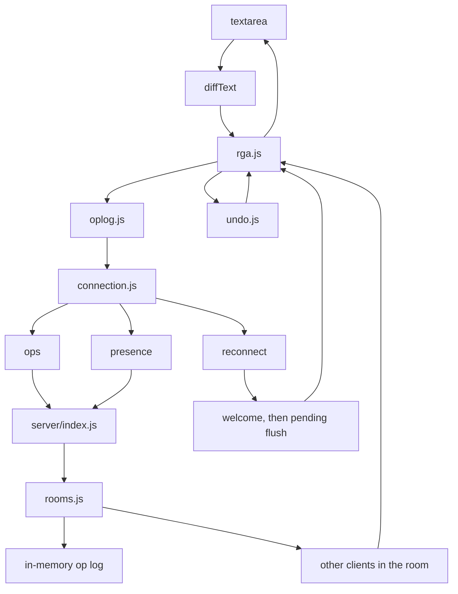
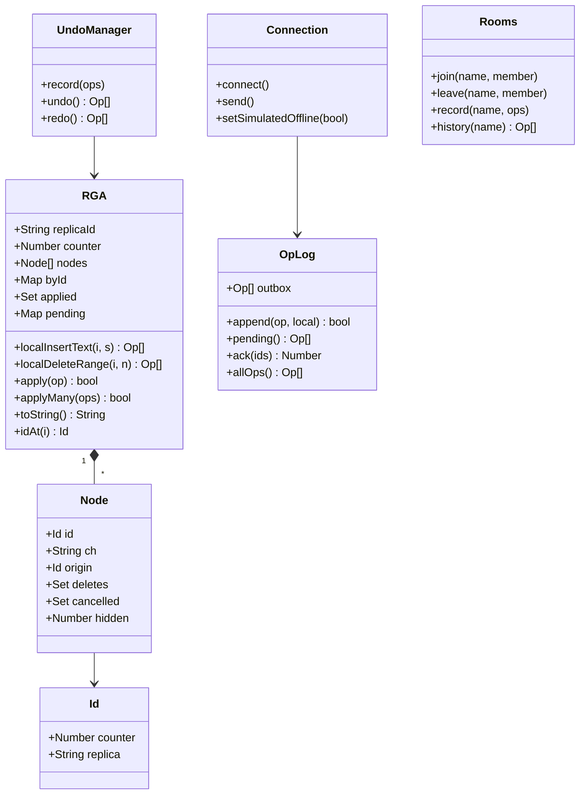

# Converge

Collaborative plain-text editor. Concurrent edits are merged with an RGA
sequence CRDT implemented in this repository (not Yjs or Automerge). The server
is a WebSocket relay; it does not interpret operations.

Demo: https://converge-yok8.onrender.com  

The demo host sleeps when idle. The first request after that can take about a
minute.

## Build

Requires Node 20+.

```
npm install
npm start          # http://localhost:8080
npm test
```

The only runtime dependency is `ws`. There is no compile step. `crdt/rga.js` is
loaded as an ES module by both Node and the browser.

Usage: open `/` in two browsers (or two tabs). The `?room=` query selects the
document. If it is omitted, a new room name is generated. **Go offline** stops
sending; local edits are queued and sent on reconnect.

## Layout

```
crdt/rga.js          RGA document
crdt/oplog.js        per-replica log and outbox
client/main.js       DOM, diffing, carets, presence
client/connection.js WebSocket client, reconnect, flush
client/undo.js       undo/redo
server/index.js      HTTP + WebSocket
server/rooms.js      room membership and op history
```

## Architecture



## Design

Each character is a node `{id, ch, origin}`. `id` is a Lamport timestamp
`(counter, replicaId)`. `origin` is the id of the node this character was
inserted after.

Operations:

| type | fields | effect |
| --- | --- | --- |
| `insert` | `id, ch, origin` | insert `ch` after `origin` |
| `delete` | `id, target` | hide `target` (tombstone) |
| `undelete` | `id, target, deleteId` | cancel one delete of `target` |

Positions are not stored. Indices are computed only when talking to the
textarea.

**Insert.** From `indexOf(origin) + 1`, skip nodes whose id is greater than the
new id; insert before the first lesser id. Concurrent inserts at the same origin
are therefore totally ordered. A node id is always greater than its origin
(the local clock is raised when a remote id is observed), so the scan stays
inside the origin's subtree.

**Delete.** Tombstones are retained. An insert may still name a deleted node as
its origin. `hidden` is a counter, not a boolean, so concurrent deletes of the
same node compose and can be undone independently.

**Causal order.** If an op arrives before the node it refers to, it is stored in
`pending` keyed by the missing id and retried when that node appears.

**Undo.** The stack records op ids. Inverses are:

```
insert(id)                 -> delete(target: id)
delete(id, target)         -> undelete(target, deleteId: id)
undelete(id, target, ...)  -> delete(target)
```

Each inverse is a new op. The stack is local to a replica.

**Sync.** On connect the server sends the room history (`welcome`). The client
applies it, then resends ops that have not been acknowledged. Acknowledgements
are matched by op id.

**Relay.** `server/` appends ops whose `id` has a numeric `counter` and a
non-empty `replica` string. It does not merge, order, or transform them. Empty
rooms are discarded after 10 minutes. State is in memory.

## Protocol

JSON over WebSocket.

| | type | body |
| --- | --- | --- |
| S→C | `welcome` | `room`, `replica`, `ops`, `peers`, `limits.maxOpsPerMessage` |
| C→S | `ops` | `ops` (truncated to `maxOpsPerMessage`; remainder unacked) |
| S→C | `ops` | `ops`, `from` |
| S→C | `ack` | `ids` |
| C→S | `presence` | `cursor` (`{id}` or `null`); not persisted |
| S→C | `presence`, `peer-left`, `peers` | replica list / cursor |

## Structure



## Tests

`npm test` (57 cases):

- Multi-replica random edits with out-of-order delivery (3 and 5 replicas)
- Same operation set applied in shuffled order
- Node-array equality, not only string equality
- Undo with concurrent remote inserts and overlapping deletes
- Relay tests on real sockets (late join, reconnect, caps, malformed frames)

## Limits

- Insert and lookup are O(n) in document length.
- Tombstones are not collected; memory grows with edit count.
- One node per character.
- No persistence across process restart.
- Plain text only.
- Presence is not in the CRDT.

## Deploy

`render.yaml` runs `npm start` (`node server/index.js`) on `$PORT`. Health check:
`/healthz`.
