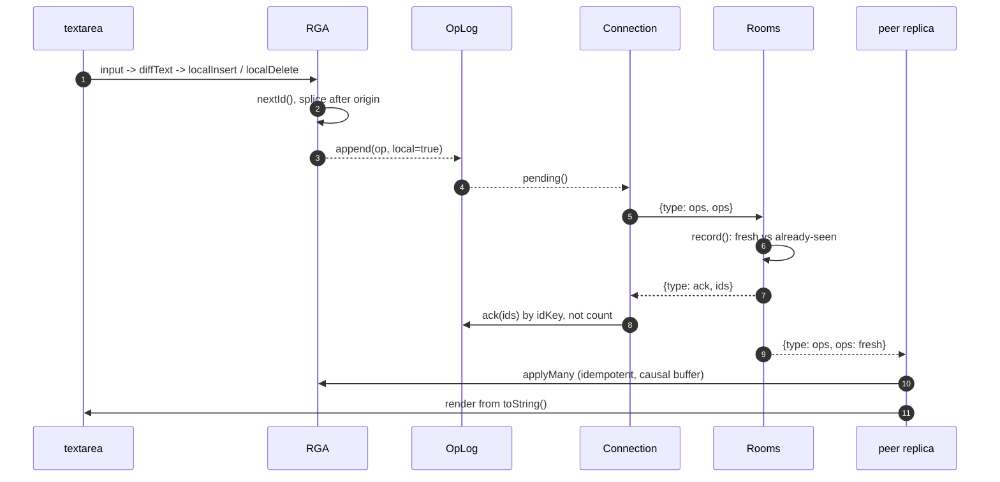
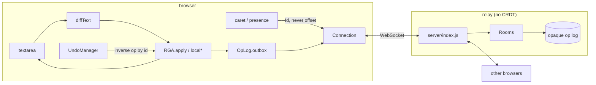

# Converge

**Live demo:** https://converge-yok8.onrender.com
(first load may take up to a minute if the service was sleeping)

A real-time collaborative plain-text editor. Several people type in the same
document at once, go offline, come back, and everyone ends up with identical
text. The merge engine is an RGA sequence CRDT written in this repo. No Yjs, no
Automerge, no operational-transform library.

```
npm install
npm start          # http://localhost:8080
npm test           # 57 tests
```

Open two tabs on the same room. Type in both. Click **Go offline** in one, keep
editing, then come back: both tabs contain both sets of edits. Undo in the
reconnected tab removes that tab's characters, not whatever now sits at those
offsets.

## What everything does

```
crdt/rga.js          sequence CRDT (~350 lines, no deps)
crdt/oplog.js        local history + unacked outbox
client/main.js       textarea <-> CRDT, caret ids, presence
client/connection.js reconnect, backoff, outbox flush
client/undo.js       inverse ops keyed by id, not position
server/index.js      WebSocket relay + static files
server/rooms.js      membership + opaque append-only log
```

- **RGA.** Each character is a node with a Lamport id `{counter, replica}` and an
  `origin` (the node it was inserted after). Concurrent inserts at the same
  origin sort newest-first by id. Deletes are tombstones; visibility is a count,
  so two replicas can delete the same character and each delete stays independently
  undoable.
- **Op log.** Local ops stay in an outbox until the server acks them **by id**.
  Acks can arrive twice, out of order, or for a previous socket.
- **Undo.** `insert` inverts to `delete(target: id)`, `delete` to
  `undelete(target, deleteId)`, and back. Undo is a new op, so remote replicas
  need no undo code.
- **Relay.** Stores opaque JSON per room, replays it to joiners, forwards new
  blobs. It never merges. Structural check only: an op must have an id, because
  that is how dedup and acks are keyed.
- **Offline.** On connect: apply the room log (idempotent), then resend
  everything unacked. That is the whole sync algorithm.

## Architecture

```mermaid
classDiagram
  direction LR

  class Id {
    +Number counter
    +String replica
  }

  class Node {
    +Id id
    +String ch
    +Id origin
    +Set~Id~ deletes
    +Set~Id~ cancelled
    +Number hidden
  }

  class Op {
    <<enumeration>>
    insert : {id, ch, origin}
    delete : {id, target}
    undelete : {id, target, deleteId}
  }

  class RGA {
    +String replicaId
    +Number counter
    +Node[] nodes
    +Map byId
    +Set applied
    +Map pending
    +localInsertText(index, text) Op[]
    +localDeleteRange(index, count) Op[]
    +localDeleteById(target) Op
    +localUndelete(target, deleteId) Op
    +apply(op) Boolean
    +applyMany(ops) Boolean
    +toString() String
    +idAt(index) Id
    +indexAfterOrBefore(id) Number
  }

  class OpLog {
    +String replicaId
    +Object[] entries
    +Set index
    +Op[] outbox
    +append(op, local) Boolean
    +pending() Op[]
    +ack(ids) Number
    +allOps() Op[]
  }

  class UndoManager {
    +Object[] undoStack
    +Object[] redoStack
    +record(ops)
    +undo() Op[]
    +redo() Op[]
  }

  class Connection {
    +String room
    +String replica
    +WebSocket ws
    +Set inflight
    +Number maxOpsPerMessage
    +connect()
    +send()
    +sendPresence(cursor)
    +setSimulatedOffline(bool)
  }

  class Rooms {
    +Map rooms
    +Number ttlMs
    +Number maxOps
    +Number maxRooms
    +Number maxClientsPerRoom
    +join(name, member) Room
    +leave(name, member)
    +record(name, ops) FreshAccepted
    +history(name) Op[]
  }

  class Room {
    +String name
    +Set members
    +Op[] log
    +Set seen
    +Timer reapTimer
  }

  RGA "1" *-- "*" Node : nodes
  Node --> Id
  Node --> Op : addressed by id
  UndoManager --> RGA : invert via id
  Connection --> OpLog : flush pending / ack by id
  OpLog "*" -- Op
  Rooms "1" *-- "*" Room
  Room o-- Op : opaque blobs
```

The browser holds the CRDT. The server holds bytes.



Reconnect is the same two messages in reverse: the relay sends `{type: welcome, ops: history}` (apply everything), then the client resends `pending()`. Duplicates are free.



Wire protocol, all JSON:

| Direction | `type` | Payload |
| --- | --- | --- |
| S -> C | `welcome` | `{room, replica, ops, peers, limits.maxOpsPerMessage}` |
| C -> S | `ops` | `{ops}`  (capped per frame; tail left unacked) |
| S -> C | `ops` | `{ops, from}` |
| S -> C | `ack` | `{ids}`  matched by `{counter, replica}` |
| C -> S | `presence` | `{cursor: {id} \| null}`  ephemeral, not stored |
| S -> C | `presence` / `peer-left` / `peers` | replica list and cursor ids |

## Design choices

**RGA over OT.** Operational transformation needs a central server to impose a
total order, which makes offline editing hard. A CRDT makes operations commute
by construction. Among sequence CRDTs, RGA has constant-size ids and an
insertion scan whose correctness argument fits in a paragraph: a node always
sorts above its origin (Lamport clock is raised on observe), and the node that
terminates the origin's subtree always sorts below it, so the scan cannot
escape.

**Tombstones stay.** If A deletes `X` while B inserts after `X`, removing `X`
leaves B's insert with nowhere to go. Collecting tombstones needs causal
stability across every replica. The editor shows the live count instead of
hiding the cost.

**Undo is keyed by op id.** A stack that records "five characters at index 12"
deletes someone else's text if they inserted above 12 in the meantime. Ids never
move. The tradeoff: undo means "revert my operation", not "restore how it
looked". The latter is not well-defined under concurrency.

**The server does not understand the CRDT.** It cannot corrupt a document. The
worst it can do is deliver ops late, twice, or out of order, which clients
already tolerate. Most tests need no server.

**No database.** Room logs are in-memory and dropped 10 minutes after the last
peer leaves. Durability is outside the merge semantics; the log is already
append-only, so persistence later is "write this sequence somewhere".

## Testing

`npm test` is 57 tests, no extra deps besides `ws`:

- 3- and 5-replica fuzzing, partial out-of-order delivery, 61 deterministic seeds
- One op set replayed in ten random orders (commutativity directly)
- Convergence asserted on the full node array, not just `toString()`
- Undo under concurrent remote inserts and overlapping deletes
- End-to-end over real sockets: late joiners, disconnect-edit-reconnect, rate
  limits, malformed frames

## Stack

- Backend: Node, `ws` (the only runtime dependency)
- Frontend: vanilla JS, no framework, no build step
- Deploy: Render (`render.yaml`), Node 20, `/healthz`
- CI: Node 20 and 22
